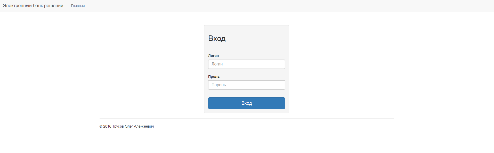
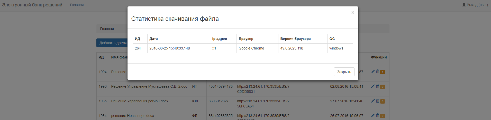
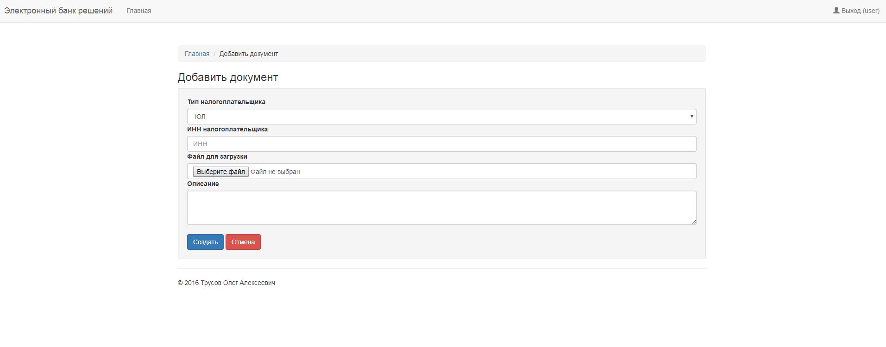

Электронный банк решений
=========================

Сервис позволяет загрузить файл и получить ссылку на этот файл во внешней сети (интернет).
Сервис предназначен для регионального и местного уровней.

## Основание
Отдел досудебного урегулирования налоговых споров (исх. 0715-СЗ@ от 21.02.2013)

## Установка и настройка
* Дать права записи на каталог `share_files/`
* В файле `protected/config/main.php` прописать настройки подключения к БД MS SQL Server.

## Скриншоты

